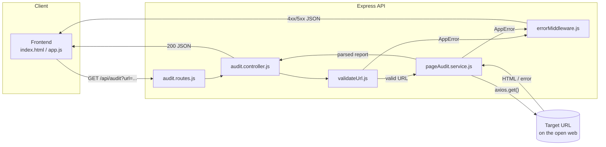
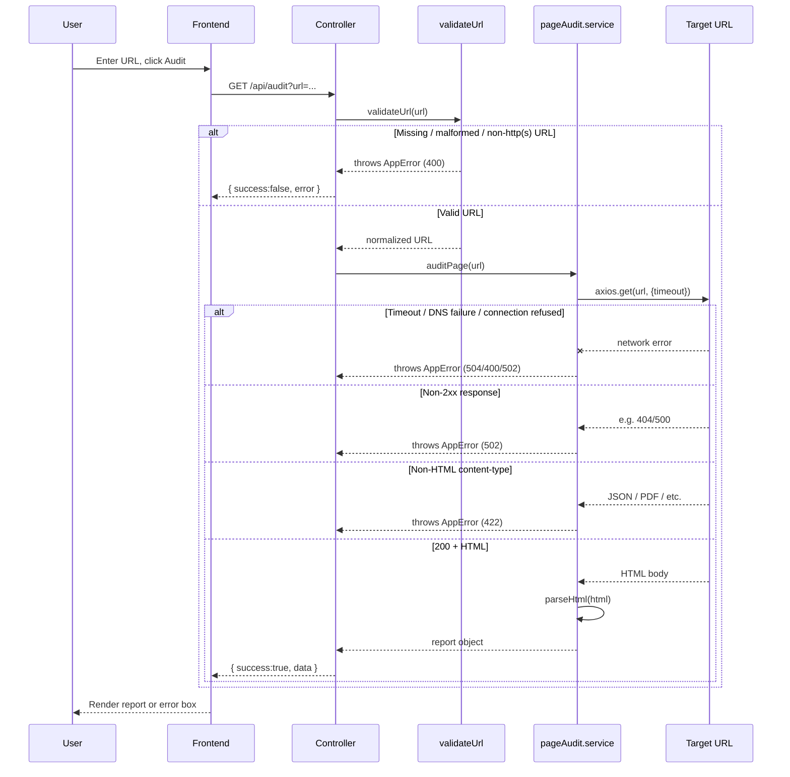

# Page Pulse

A small web tool that audits any URL — fetches the page, reports HTTP status, response time, title, meta description, H1 count, images missing alt text, and approximate word count.

**Live demo:** https://wondrous-twilight-6528ba.netlify.app
**API base URL:** https://page-pulse-miu1.onrender.com

> **Note:** the backend is hosted on Render's free tier, which spins down after inactivity. The first request after idle time can take 20-50 seconds to respond — this is expected cold-start behavior, not a bug. Subsequent requests are fast.

---

## Contents

- [What this is](#what-this-is)
- [Architecture](#architecture)
- [Request lifecycle](#request-lifecycle)
- [API contract](#api-contract)
- [Design decisions](#design-decisions)
- [Local setup](#local-setup)
- [Running tests](#running-tests)
- [Known limitations](#known-limitations)

---

## What this is

Page Pulse takes a URL, fetches it server-side, and returns a structured JSON report on the page's health and basic SEO/accessibility signals. Built as a two-part exercise: an API + UI (Task A), and a defensible, tested version of the same tool (Task B).

**Stack:** Node.js, Express, Axios, Cheerio (backend) · vanilla HTML/CSS/JS (frontend) · Jest (tests)

---

## Architecture

Deliberately layered so each piece has one job: routes wire HTTP to controllers, controllers handle request/response concerns only, services own the actual fetch-and-parse logic and know nothing about Express.



**Why this shape:** a reviewer should be able to tell where any given piece of logic lives without reading the whole file. Validation is separated from fetching so a bad URL never touches the network. Parsing (`parseHtml`) is a pure function — no I/O — so it can be unit tested without mocking HTTP calls.

---

## Request lifecycle

Shows both the happy path and where each error type in Milestone 2 is caught.



---

## API contract

### `GET /api/audit?url={targetUrl}`

**Success — `200 OK`**
```json
{
  "success": true,
  "data": {
    "url": "https://example.com/",
    "httpStatus": 200,
    "responseTimeMs": 184,
    "title": "Example Domain",
    "metaDescription": null,
    "h1Count": 1,
    "imagesMissingAltCount": 2,
    "imagesMissingAlt": ["/img/hero.png", "/img/icon.svg"],
    "wordCount": 42
  }
}
```

**Failure — `4xx` / `5xx`**
```json
{
  "success": false,
  "error": {
    "code": "UNSUPPORTED_CONTENT_TYPE",
    "message": "Expected HTML but got content-type \"application/json\"."
  }
}
```

| Code | Status | Meaning |
|---|---|---|
| `MISSING_URL` | 400 | `url` query param absent |
| `INVALID_URL` | 400 | Not a parseable URL |
| `UNSUPPORTED_PROTOCOL` | 400 | Not http/https |
| `HOST_NOT_FOUND` | 400 | DNS resolution failed |
| `FETCH_TIMEOUT` | 504 | Target didn't respond in time |
| `CONNECTION_FAILED` | 502 | Connection refused/reset |
| `TOO_MANY_REDIRECTS` | 502 | Redirect chain exceeded limit |
| `UPSTREAM_ERROR_STATUS` | 502 | Target responded non-2xx |
| `UNSUPPORTED_CONTENT_TYPE` | 422 | Target isn't HTML |
| `NOT_FOUND` | 404 | Unmatched API route |
| `INTERNAL_ERROR` | 500 | Unexpected server error |

### `GET /health`
Returns `{ "status": "ok" }`. Used to verify the deployment is live.

---

## Design decisions

**1. Word count = visible body text only, scripts/styles stripped.**
"Approximate word count" is ambiguous in the brief — counting raw HTML would include script/style content that no reader ever sees. Stripped `<script>`, `<style>`, `<noscript>` before splitting on whitespace, since that's what "word count" means to an actual page visitor.

**2. Errors are typed by cause, not lumped into one generic failure.**
Network failure, non-2xx upstream status, and wrong content-type are three different `AppError` codes rather than a single catch-all. A client consuming this API can distinguish "the target site is down" from "the target isn't HTML" and react differently — collapsing them would make the API contract technically simpler but practically useless for a real consumer.

**3. Content-type is checked explicitly before parsing, not caught via exception.**
Cheerio doesn't throw on non-HTML input — it will silently "parse" a JSON or PDF response into a mostly-empty DOM instead of failing loudly. Relying on try/catch here would produce a false-positive success. An explicit `Content-Type` header check before parsing was the only way to catch this reliably.

---

## Local setup

```bash
git clone <this-repo>
cd page-pulse/backend
cp .env.example .env
npm install
npm run dev          # http://localhost:3000
```

Frontend is static — no build step:
```bash
cd ../frontend
npx serve .           # or open index.html directly
```
Before running locally against a deployed backend, edit `frontend/config.js` to point at the correct `API_BASE_OVERRIDE`.

---

## Running tests

```bash
cd backend
npm test
```
Covers the parsing logic in isolation: happy path plus the required failure cases (malformed HTML input, empty document). See `backend/src/services/__tests__/pageAudit.service.test.js`.

---

## Known limitations

Scoped out deliberately to stay within the brief rather than over-building:

- **No SSRF protection.** The server will fetch any http(s) URL a user provides, including internal/private IP ranges. For a public-facing production version, requests to private IP blocks and cloud metadata endpoints (e.g. `169.254.169.254`) should be blocked before the fetch is made.
- **No rate limiting.** Fine for a reviewed take-home; would need per-IP limits before being exposed publicly at scale.
- **No request cancellation on the frontend.** Rapid resubmits queue independent fetches rather than aborting the in-flight one; `AbortController` would fix this.

---

Built for [Digital Heroes](https://digitalheroesco.com) Training Task.